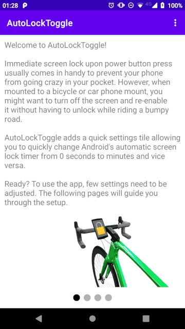

# Android AutoLockToggle
Adds an Android quick settings tile to change automatic screen lock timer from 0 seconds and minutes and vice versa.

Immediate screen lock upon power button press usually comes in handy to prevent your phone from going crazy in your pocket. However, when mounted to a bicycle or car phone mount, you might want to turn off the screen and re-enable it without having to unlock while riding a bumpy road.



# Full install instructions
1. Clone this repository and build and install with Android Studio or download latest build from [releases](https://github.com/F1iX/AutoLockToggle/releases)
1. Follow the setup guide provided in the app
    1. Connect your device to a computer with Android Debugging Bridge installed and run
        ```
        adb shell pm grant me.keppler.autolocktoggle android.permission.WRITE_SECURE_SETTINGS
        ```
    1. In Android's screen lock settings, disable *Power button instantly locks*
    1. Add quick settings tile to quick settings drawer